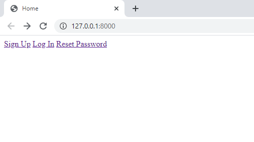

# Projects quickly

## Demo
    


## Utilities

- [x] Python 3.8 - Django 3.0
- [x] Custom User model
- [x] Custom backend email/user log in
- [x] Class Based Views
    - [x] Sign Up
    - [x] Log In
    - [x] Log out
    - [x] Change Password
    - [x] Reset Password
- [x] [django-debug-toolbar](https://django-debug-toolbar.readthedocs.io/en/latest/)
- [x] Without styles

## Setup
Python 3 and Virtual environment are already installed.
```
$ git clone https://github.com/luishiguera/djangofast.git
$ cd djangofast
$ pip install -r requirements.txt
```
Migrate
```
(env) $ python manage.py makemigrations accounts
(env) $ python manage.py migrate
```
Create superuser
```
(env) $ python manage.py createsuperuser
```
Runserver
```
(env) $ python manage.py runserver
```